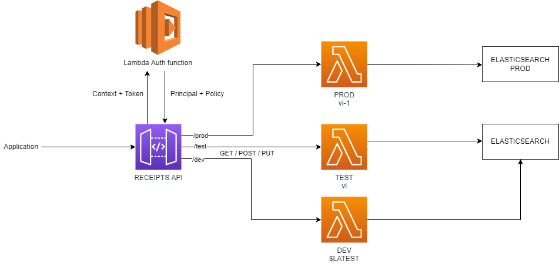

# Proposed solution
## Architecture:

As a solution for the problem, i propose a full serverless architecture. The architecture i though first was similar than this:

Currently i've implemented a solution with a dynamo instead ElasticSearch and it's not finished yet.

The current architecture made of:

- **API GateWay**:
    - Model for recipe.
    - Created the DEV stack.
    - Methods GET, POST, PUT for retrieve, create, update recipes, respectively, and configure requests bodies and query string params.
      - GET: We will send the id in query param /recipes/recipt_id={id}
      - POST: We will send the recipe in body of the request.
      - PUT: We will send the id and fields to modify in the body.

    - Configure requests validators in order to deny wrong requests
    - Create a simple authorizer

    Next steps:
    - Create dev/test/prod stages
    - Improve authorizer with a token validation by user and with lifetime
    - Create an API KEY for the API

- A **lambda** to handle the requests of the API. As solution for Lambda, i propose a simple lambda function with CRUD operations into a database.

  Next steps:
  - We should use alias and versions in lambda for prod/test/dev environments with vi-1, vi and $LATEST versions respectively.
  - Improve the code with Exceptions handling, etc

- As **database**, how this role request experience in **ElasticSearch** i would have choosen it, but in order to simplify the deployment, i choosed a dynamoDB, which is non-relational db as well and it's a native aws resource (more annoying, in my opinion...)
  
- For **authentication**, we could use JWT with a own aws service like [AWS Cognito](https://aws.amazon.com/cognito/) or with a lambda authorizer function that will be called by the API Gateway and it's often used in API Gateway.  
I started to create an authorizer which just allow access when a header contains a valid token 'allow'.
Also the API will have an API KEY to allow access to the API.

In the other hand, i created a simple client to test the API:
Create a recipe and search it is ready, but update recipe is not finished.

